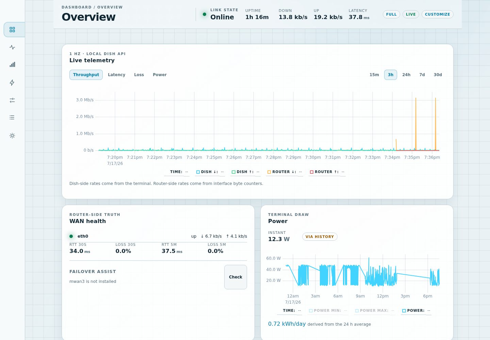
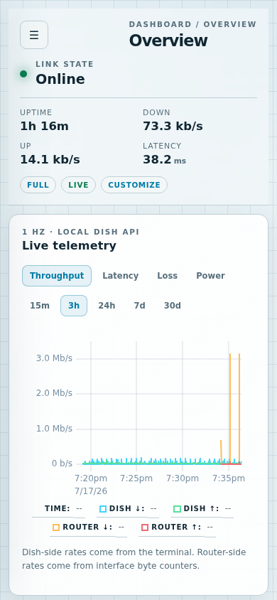

# Starwatch for OpenWrt

**Product page: [keithah.com/products/starwatch](https://keithah.com/products/starwatch)**

Starwatch is an offline-first Starlink observatory for OpenWrt and GL.iNet
routers. A static Go daemon reads the dish's local gRPC API, combines dish and
router-side WAN telemetry, keeps tiered history, evaluates alerts, exposes a
token-authenticated REST/WebSocket API, and serves a responsive embedded
dashboard. No cloud account or Internet connection is required.
After installation, monitoring and administration remain entirely local; the
one-line installer itself downloads packages from GitHub Pages.

The dashboard is available directly on port 9633, from **Services →
Starwatch** in LuCI, or from **Applications → Starwatch** in the GL.iNet panel.
The admin-panel packages pass the generated token to the dashboard through a
small authenticated RPC bridge, so the router login remains the access
boundary.

## Quick install

The public 0.1.1 feed currently supports `aarch64_cortex-a53` routers. Connect
over SSH as root and run:

```sh
wget -qO- https://keithah.github.io/openwrt-starwatch/install.sh | sh
```

The installer checks the opkg architecture before changing anything. GL.iNet
SDK4 routers receive `starwatchd` plus `gl-app-starwatch`; other supported
OpenWrt routers receive `starwatchd` plus `luci-app-starwatch`. It manages only
the `starwatch` entry in `/etc/opkg/customfeeds.conf`, preserving every other
feed and all existing Starwatch configuration. It never forces a downgrade or
reinstall. The feed index is signed with a dedicated Starwatch key installed
alongside OpenWrt's existing opkg keys; global signature checking stays enabled.

After installation, open `http://<router-address>:9633`, **Services →
Starwatch** in LuCI, or **Applications → Starwatch** in the GL.iNet panel.
Direct access prompts for the token shown by
`uci get starwatch.main.token`; the LuCI and GL.iNet launchers supply it
through their authenticated admin sessions.

## Dashboard

The dashboard's Telemetry graphs and header metrics come only from the Starlink
terminal's gRPC data. When no terminal is reachable, every current-data card is
replaced by an explicit **Starlink disconnected** state; no attached WAN's
router counters or probes are shown as substitute telemetry. Settings and the
historical Events audit view remain available, and cards return automatically
when the dish reconnects. The icon rail groups available cards into focused
sections, while Overview visibility and compact density stay private to the
current browser.



<p align="center">
  
</p>

## Build the packages

The packages use the same no-SDK pipeline verified by Wattline on a GL-X3000:
a plain static Go cross-compile and hand-rolled OpenWrt packages.

```sh
make -C package all
ls -la package/out/*.ipk
```

The build produces:

- `starwatchd_0.1.1_aarch64_cortex-a53.ipk` — static daemon, embedded SPA,
  UCI configuration, guarded dish route, token generator, and procd service.
- `luci-app-starwatch_0.1.1_all.ipk` — LuCI menu, one-method rpcd bridge, and
  iframe launcher.
- `gl-app-starwatch_0.1.1_all.ipk` — GL.iNet oui menu, Lua RPC bridge, and
  evaluated Vue 2 iframe view.

The outer `.ipk` is a **gzipped ustar tar**, not an `ar` archive. Its three
members are `debian-binary`, `control.tar.gz`, and `data.tar.gz`. This exact
format matters: the GL-X3000 opkg build segfaults on the ar form and rejects
macOS pax headers. All payload paths remain below ustar's 100-character limit.

`ARCH` defaults to `aarch64_cortex-a53`. Override the version or filename
architecture when needed:

```sh
make -C package VERSION=0.1.1 ARCH=aarch64_cortex-a53 all
```

The committed GL view at
`package/gl-app-starwatch/www/views/gl-sdk4-ui-starwatch.common.js` was produced
as the returning Vue 2 IIFE consumed by GL's `eval(res.data)` loader, following
the live-verified Wattline bundle contract. `package/Makefile` creates the
`.js.gz` artifact installed under `/www/views`; no npm or frontend build step is
required.

When iterating, remember that `opkg install` skips a same-version reinstall.
Use `opkg install --force-reinstall`, or preferably bump `VERSION`, so the
control metadata, filename, and feed index advance together.

## Development install over SSH

OpenWrt dropbear often lacks scp support, so pipe each package over SSH:

```sh
for f in package/out/*.ipk; do
  ssh root@192.168.8.1 "cat > /tmp/$(basename "$f")" < "$f"
done

ssh root@192.168.8.1 'opkg update && opkg install \
  /tmp/starwatchd_0.1.1_aarch64_cortex-a53.ipk \
  /tmp/luci-app-starwatch_0.1.1_all.ipk \
  /tmp/gl-app-starwatch_0.1.1_all.ipk'
```

Install either admin-panel package or both. `starwatchd`'s post-install script
runs `/etc/uci-defaults/99-starwatch`, enables the service, and **restarts** it
so upgrades immediately use the new binary. The defaults script generates a
token when empty. It adds `network.starwatch_dish`, a `/32` route through the
logical `wan` interface, only when neither UCI nor the live kernel table already
contains a dish host route. Behind a Starlink router it includes the WAN
gateway only when that gateway is on the physical WAN subnet, so a
Speedify/VPN default route cannot capture dish management traffic.
Bypass/direct-DHCP setups without a gateway use a link-scope route. The daemon
reasserts this exact `/32` at startup and during discovery retries; set
`manage_dish_route` to `0` if another service owns the route.

GL.iNet 4.x ships the LuCI libraries without a theme. Install Bootstrap before
the LuCI launcher with `opkg install luci-theme-bootstrap`. The GL admin-panel
menu is loaded at login, so log out and back in once after installing
`gl-app-starwatch` for **Applications → Starwatch** to appear.

## Upgrade and publish the opkg feed

The installer registers the public GitHub Pages feed. Upgrade through normal
opkg version ordering with the package selected for your router type:

```sh
opkg update
opkg upgrade starwatchd luci-app-starwatch
# GL.iNet SDK4: opkg upgrade starwatchd gl-app-starwatch
```

Maintainers can stage the exact static GitHub Pages feed artifact locally:

```sh
make -C package feed-artifact
# unsigned local staging: package/out/pages/{Packages,Packages.gz,install.sh,*.ipk}
```

Version-tag and explicit manual GitHub Actions runs publish that verified
artifact to `https://keithah.github.io/openwrt-starwatch/`. Pull requests and
ordinary `main` pushes run the same build and tests without deploying. The
deployed artifact also contains `Packages.sig` and the public verification key;
the private signing key remains in GitHub Actions secrets.

The GL.iNet Plug-ins page can use the same feed. mwan3 is optional; Starwatch
reports its status and offers an explicit failover-assist flow when installed.

## Configuration

`/etc/config/starwatch` is an opkg conffile, so local changes survive upgrades.
The safe subset is also editable from the dashboard.

```uci
config starwatch 'main'
    option listen '0.0.0.0'
    option port '9633'
    option token ''
    option dish_addr '192.168.100.1:9200'
    option manage_dish_route '1'
    option poll_status '1'
    option poll_map '900'
    option wan_iface ''
    option probe_hosts '1.1.1.1 8.8.8.8'
    option probe_interval '2'
    option location_enabled '0'

config history
    option ram_hours '3'
    option minute_days '7'
    option quarter_days '30'
    option db_path '/etc/starwatch/history.db'
    option flush_secs '300'

config alerts
    option webhook_url ''
    option ntfy_url ''
```

The shipped file documents every alert enable and threshold. The principal
thresholds are outage hold (30 seconds), unreachable hold (60 seconds), path
loss (20%), path RTT (300 ms), path clear hold (300 seconds), and daily
obstruction (2%). Changes to listen address, port, token, dish address, RAM
capacity, database path, or flush cadence require a service restart.

Useful service commands:

```sh
/etc/init.d/starwatch restart
/etc/init.d/starwatch reload
logread -e starwatchd
```

## API summary

All `/api/*` routes require `Authorization: Bearer <token>`; browser clients
may use `?token=` for WebSocket and bootstrap access. Read the generated token
with `uci get starwatch.main.token`.

| Endpoint | Purpose |
|---|---|
| `GET /api/status` | Dish, topology, availability, config readback, and router card |
| `GET /api/diagnostics?span=` | Derived latency, ping, outage, power, and configured-battery summaries |
| `GET /api/router` | Topology-B Starlink-router read model, clients, radios, and interfaces |
| `GET /api/history?series=&span=` | RAM/minute/quarter telemetry history |
| `GET /api/wan` | Interface probes, rates, and optional mwan3 state |
| `GET /api/outages?span=` | Merged dish, reachability, and path outage timeline |
| `GET /api/events?span=` | Alert, control, configuration, and lifecycle audit log |
| `GET /api/obstruction-map` | Cached obstruction grid or PNG |
| `POST /api/control/<action>` | Audited dish controls |
| `GET`, `POST /api/speedtest` | Speed-test state and trigger |
| `GET`, `PUT /api/config` | Read or update safe daemon settings |
| `PATCH /api/router/clients/{mac}` | Confirmed client rename and Starwatch-owned schedule block/unblock |
| `PATCH /api/router/wifi` | Guarded scalar Wi-Fi/radio edits and credential-preserving BSS edits |
| `GET /api/ws` | One-hertz snapshots and asynchronous events |

The complete wire format and operational constraints are in
[`API.md`](API.md) and [`STARWATCH-SPEC.md`](STARWATCH-SPEC.md). Release notes
are maintained in [`CHANGELOG.md`](CHANGELOG.md).

## Security

Please report vulnerabilities privately — see [`SECURITY.md`](SECURITY.md). The
opkg feed is `usign`-signed; the installer pins the public key (fingerprint
`f6c72c675c844b91`, [`package/starwatch-feed.pub`](package/starwatch-feed.pub))
and leaves signature checking enabled.

## License

Starwatch is licensed under the **GNU Affero General Public License v3.0 or
later** (AGPL-3.0-or-later); see [`LICENSE`](LICENSE). Vendored protobufs under
`router/third_party/` retain their own upstream license.
